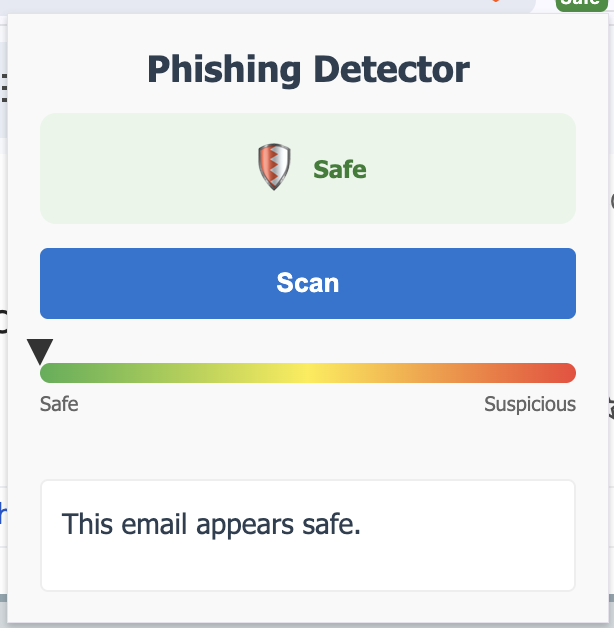
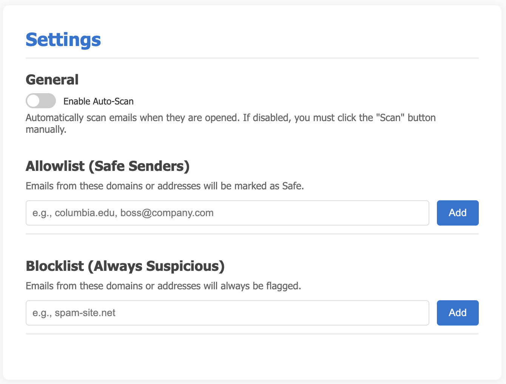
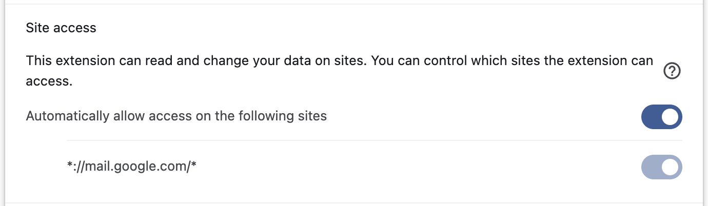

# 🦁 Phishing & Deepfake Detection for Gmail

A privacy-first Chrome extension designed to protect Columbia University students (and everyone else!) from phishing attacks and deepfake content in Gmail.

## 1. Problem Statement: Why Phishing Matters?
One of the weakest links in cybersecurity is, arguably, the human element. Modern phishing attacks, particularly those leveraging AI-generated content or deepfake media, can easily bypass traditional email spam filters. These filters often rely on static blacklists, signature matching, or simple heuristics. As a result, users receive no real-time analysis at the moment they actually read an email, leaving them vulnerable to increasingly sophisticated social engineering attacks.

## 2. Our Solution: Client-Side Phishing Detection
We have developed a Chrome extension that performs client-side phishing and deepfake detection directly within the Gmail interface. Unlike server-side filters, our tool focuses on user-level intelligence, analyzing content in real-time as the user opens it.

## ✨ Key Features

*   **🛡️ Privacy-First**: All analysis happens **locally** on your browser. No email data is ever sent to external servers.
*   **🧠 Hybrid Detection**: Combines a Naive Bayes Machine Learning model with heuristic rules for robust detection.
*   **🔍 Explainable AI**: The popup lists the top reasons for the verdict (e.g., "Suspicious sender", "Urgent language").
*   **⚙️ Customizable Settings**:
    *   **Allowlist**: Mark trusted domains (e.g., `columbia.edu`) to skip scanning.
    *   **Blocklist**: Always flag specific suspicious senders.
    *   **Auto-Scan**: Optional feature to scan emails automatically upon opening.
*   **🦁 Custom Icons**: Features the Columbia Lion!

### Screenshots

<table>
  <tr>
    <td align="center">
      
      <br />
      <em>Figure 1: Main Popup</em>
    </td>
    <td align="center">
      
      <br />
      <em>Figure 2: Suspicious Email</em>
    </td>
    <td align="center">
      
      <br />
      <em>Figure 3: Safe Email</em>
    </td>
  </tr>
</table>

### Settings & Configuration

*Figure 4: The options page for customizing settings and allow/block lists.*


*Figure 5: Permissions requested by the extension.*

## 🚀 Installation

1.  Clone or download this repository.
2.  Open Chrome and navigate to `chrome://extensions`.
3.  Enable **"Developer mode"** in the top right corner.
4.  Click **"Load unpacked"**.
5.  Select the `phishing-detection-extension` directory.

## 📖 Usage

### Default Mode (Privacy-Focused)
1.  Open an email in Gmail.
2.  The extension icon will show a **Yellow "Scan"** badge.
3.  **Click the extension icon** and hit the **"Scan"** button.
4.  The badge will update to:
    *   **Green (Safe)**: No issues found.
    *   **Red (!)**: Suspicious content detected.
    *   **Grey (Skip)**: Sender is in your Allowlist.

### Settings & Configuration
Right-click the extension icon and select **"Options"** to access the Settings Page:

*   **Enable Auto-Scan**: Toggle this to have the extension automatically scan every email you open (no click required).
*   **Allowlist**: Add safe domains (e.g., `columbia.edu`) to ignore warnings.
*   **Blocklist**: Add known spam domains to always flag them.

## 🔧 Technical Implementation

### Scam Detection Algorithm
Our detection engine combines rule-based heuristics with a Machine Learning model to calculate a risk score (0-100).

#### A. Naive Bayes Classifier
*   **Model**: Trained on approximately 82,500 emails (spam and ham).
*   **Method**: Computes `P(word | class)` using Laplace smoothing to handle unseen words.
*   **Decision**: An email is flagged if `P(email | phishing) > P(email | legitimate)`.
*   **Integration**: The model parameters (word counts) are compressed into a JSON file (`model.json`) and loaded locally by the extension.

#### B. Heuristics Engine
We apply a set of deterministic rules to catch common phishing patterns:
*   **Sender Verification**: Checks for verified senders and allowlisted domains.
*   **Impersonation Detection**: Flags mismatches between the sender's display name and actual email address (e.g., "Bank of America <security@gmail.com>").
*   **Urgency Detection**: Scans for pressure tactics and keywords like "Immediate Action Required", "Account Locked", etc.
*   **Link Analysis**: Flags IP-based links (e.g., `192.168.1.1`) and suspicious TLDs (`.xyz`, `.top`, `.tk`).
*   **Security Protocols**: Checks for missing TLS/S/MIME encryption.

#### C. Scoring System
*   **Score Calculation**: The heuristics engine assigns a score from 0 to 100.
*   **Thresholds**: A score > 40 is considered suspicious.
*   **Hybrid Approach**: The final verdict combines the heuristic score and the Naive Bayes probability. If the ML model is highly confident (probability ≥ 0.8), it can trigger a warning even if heuristics are ambiguous.

## 🛠️ Development Structure

```text
phishing-detection-extension/
├── manifest.json
├── src/
│   ├── background/
│   │   └── background.js
│   ├── content/
│   │   └── content.js           # Extracts email data & triggers scan
│   ├── options/
│   │   ├── options.html
│   │   ├── options.js
│   │   └── options.css
│   ├── popup/
│   │   ├── popup.html
│   │   ├── popup.css
│   │   └── popup.js
│   └── utils/
│       ├── heuristics.js        # Rule-based detection logic
│       ├── naive_bayes.js       # ML classifier implementation
│       ├── model.json           # Pre-trained model parameters
│       └── explanation_generator.js
└── assets/
    ├── icons/
    └── screenshots/
```

## 🔒 Privacy Policy

This extension is strictly scoped to `mail.google.com`. It does not collect, store, or transmit your personal data. All analysis is performed client-side using JavaScript.

## 👥 Project Team and Contributions
*   **Wali Ahmed**: Dynamic explanation logic for suspicious emails.
*   **Sungjun Lee**: Extension setup, UI, and heuristic algorithms.
*   **Sameeha Liton**
*   **Isaac Schmidt**: ML model training and integration.
*   **Ryan Shi**: ML model testing.

## 📚 References
*   [Chrome Extensions Documentation](https://developer.chrome.com/docs/extensions/get-started)
*   [Gmail Security: Verified Emails](https://support.google.com/mail/answer/13130196)
*   [Kaggle: Fraudulent Email Corpus](https://www.kaggle.com/datasets/rtatman/fraudulent-email-corpus)
*   [Mailgun: Understanding Email Ports & Encryption](https://www.mailgun.com/blog/email/which-smtp-port-understanding-ports-25-465-587/)
